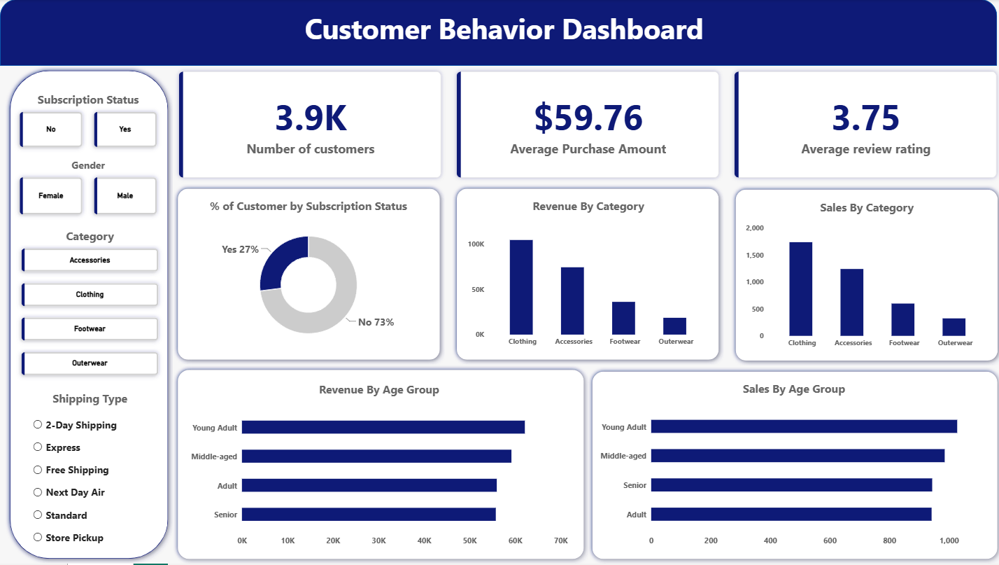

# Customer Shopping Behavior Analysis

## Overview
This end-to-end data analytics project analyzes consumer purchasing trends using transactional data from **3,900 customer records**[cite: 1]. The primary goal is to examine demographics, spending habits, subscription adoption, and shipping preferences to deliver actionable business insights and data-driven strategy recommendations.

---

## Dashboard Preview

---

## Dataset
* **Source:** Customer Shopping Behavior Dataset[cite: 1]
* **Volume:** 3,900 rows | 18 features[cite: 1]
* **Key Features:**
  * **Demographics:** Age, Gender, Location, Subscription Status[cite: 1]
  * **Purchase Details:** Item Purchased, Category, Purchase Amount (USD), Season, Size, Color[cite: 1]
  * **Behavioral:** Discount Applied, Promo Code Used, Previous Purchases, Frequency of Purchases, Review Rating, Shipping Type[cite: 1]

---

## Tools & Tech Stack
* **Python (Pandas, SQLAlchemy):** Data ingestion, exploratory data analysis (EDA), cleaning, feature engineering, database connection[cite: 1].
* **PostgreSQL:** Storing structured transactional data and running business-critical SQL queries[cite: 1].
* **Power BI:** Building dynamic, interactive visual dashboards for business stakeholders[cite: 1].
* **Gamma:** Designing an executive presentation for strategic reporting.

---

## Workflow Steps

### 1. Data Cleaning & Feature Engineering (Python)
* **EDA:** Examined overall dataset structures using `.info()` and `.describe()`[cite: 1].
* **Missing Value Imputation:** Filled 37 missing `Review Rating` values using category-wise median imputation[cite: 1].
* **Standardization:** Renamed columns to standardized `snake_case` format[cite: 1].
* **Redundancy Removal:** Dropped `promo_code_used` after validating 100% correlation with `discount_applied`[cite: 1].
* **Feature Creation:** 
  * Created `age_group` via quartile binning (`Young Adult`, `Adult`, `Middle-aged`, `Senior`)[cite: 1].
  * Mapped string-based purchase frequencies to numerical values in `purchase_frequency_days`[cite: 1].
* **Database Export:** Automated direct table write into PostgreSQL using `SQLAlchemy`[cite: 1].

### 2. Business SQL Analysis (PostgreSQL)
Executed key query analyses to extract actionable business metrics:
* **Revenue Distribution:** Aggregated total revenue split by gender and age segments[cite: 1].
* **Discount Efficiency:** Filtered high-value transactions that utilized promotional discounts[cite: 1].
* **Product Performance:** Ranked top-rated items and identified products dependent on discounts[cite: 1].
* **Customer Segmentation:** Categorized buyers into `New`, `Returning`, and `Loyal` segments based on purchase history[cite: 1].

---

## Dashboard Key Metrics
* **Executive KPIs:** Number of Customers (3.9K), Average Purchase Amount ($59.76), Average Review Rating (3.75)[cite: 1].
* **Demographic Breakdown:** Revenue and total sales across Age Groups and Gender[cite: 1].
* **Product Metrics:** Revenue and total sales distributed by Product Category[cite: 1].
* **Subscription Split:** Donut chart showing subscriber conversion rate (27% Subscribers vs. 73% Non-subscribers)[cite: 1].
* **Interactive Slicers:** Dynamic filtering by Shipping Type, Category, Gender, and Subscription Status[cite: 1].

---

## Key Results & Recommendations

### Strategic Insights
* **Subscription Gap:** 73% of customers are non-subscribers, indicating a major retention opportunity[cite: 1].
* **Top Category:** Clothing generates the highest sales volume and overall revenue[cite: 1].
* **High Loyalty Base:** The majority of customers fall into the "Loyal" purchasing segment[cite: 1].

### Business Recommendations
* **Boost Subscriptions:** Introduce exclusive rewards or perk programs to convert non-subscribers[cite: 1].
* **Loyalty Perks:** Target repeat customers with structured loyalty rewards to increase long-term customer lifetime value[cite: 1].
* **Discount Optimization:** Refine discount distribution on high-margin items to prevent profit margin erosion[cite: 1].
